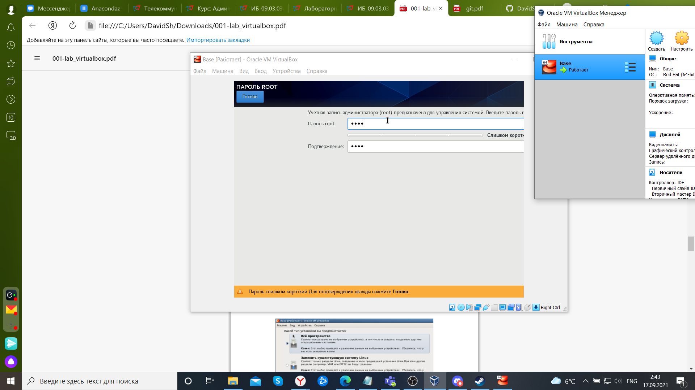

---
# Front matter
lang: ru-RU
title: "Лабораторная работа №1"
subtitle: "Установка и конфигурация операционной системы на виртуальную машину"
author: "Шагабаев Давид, НПИбд-02-18"

# Formatting
toc-title: "Содержание"
toc: true # Table of contents
toc_depth: 2
lof: true # List of figures
lot: true # List of tables
fontsize: 12pt
linestretch: 1.5
papersize: a4paper
documentclass: scrreprt
polyglossia-lang: russian
polyglossia-otherlangs: english
mainfontoptions: Ligatures=TeX
romanfontoptions: Ligatures=TeX
sansfontoptions: Ligatures=TeX,Scale=MatchLowercase
monofontoptions: Scale=MatchLowercase
indent: true
pdf-engine: lualatex
header-includes:
  - \linepenalty=10 # the penalty added to the badness of each line within a paragraph (no associated penalty node) Increasing the value makes tex try to have fewer lines in the paragraph.
  - \interlinepenalty=0 # value of the penalty (node) added after each line of a paragraph.
  - \hyphenpenalty=50 # the penalty for line breaking at an automatically inserted hyphen
  - \exhyphenpenalty=50 # the penalty for line breaking at an explicit hyphen
  - \binoppenalty=700 # the penalty for breaking a line at a binary operator
  - \relpenalty=500 # the penalty for breaking a line at a relation
  - \clubpenalty=150 # extra penalty for breaking after first line of a paragraph
  - \widowpenalty=150 # extra penalty for breaking before last line of a paragraph
  - \displaywidowpenalty=50 # extra penalty for breaking before last line before a display math
  - \brokenpenalty=100 # extra penalty for page breaking after a hyphenated line
  - \predisplaypenalty=10000 # penalty for breaking before a display
  - \postdisplaypenalty=0 # penalty for breaking after a display
  - \floatingpenalty = 20000 # penalty for splitting an insertion (can only be split footnote in standard LaTeX)
  - \raggedbottom # or \flushbottom
  - \usepackage{float} # keep figures where there are in the text
  - \floatplacement{figure}{H} # keep figures where there are in the text
---

# Цель работы

Цель работы --- приобретение практических навыков установки операционной системы на виртуальную машину, настройки минимально необходимых для дальнейшей работы сервисов.

# Задание

Установить на виртуальную машину VirtualBox (https://www.virtualbox.org/) операционную систему Linux, дистрибутив Centos.

# Выполнение лабораторной работы

1. Загрузили на своём компьютере операционную систему Windows. Осуществили вход в систему. Создали каталог с именем пользователя "dashagabaev" и скопировали в него образ виртуальной машины  (рис. -@fig:001).

{ #fig:001 width=70% }

2. Запустили виртуальную машину. Проверили в свойствах VirtualBox месторасположение каталога для виртуальных машин. 

3. Проверяем расположение каталога виртуальной машины(рис. -@fig:002).

{ #fig:002 width=70% }

4. Создали новую виртуальную машину — "Base", тип операционной системы
— Linux, RedHat (рис. -@fig:003). Указали размер основной памяти виртуальной
машины — 1024 МБ (рис. -@fig:004).

{ #fig:003 width=70% }

{ #fig:003 width=70% }

5. Задали конфигурацию жёсткого диска — загрузочный, VDI (BirtualBox
Disk Image), динамический виртуальный диск (рис. -@fig:005, рис. -@fig:006, рис. -@fig:007).

{ #fig:005 width=70% }

{ #fig:006 width=70% }

{ #fig:007 width=70% }

6. Задали размер диска — 40 ГБ, его расположение — в данном случае
/var/tmp/имя_пользователя/Base/Base.vdi (рис. -@fig:008).

{ #fig:008 width=70% }

7. Выделили в окне менеджера VirtualBox виртуальную машину Base, и открыли окно Свойства. Проверить, что папка для снимков виртуальной машины Base имеет правильный путь(рис. -@fig:009).

{ #fig:009 width=70% }

8. Выбрали в VirtualBox Свойства Носители виртуальной машины Base. Добавили новый привод оптических дисков и выбрали образ CentOS (рис. -@fig:010).

{ #fig:010 width=70% }

9. Запустили виртуальную машину Base, выбрали установку системы на жёсткий диск (рис. -@fig:011).

{ #fig:011 width=70% }

10. Установили русский язык для интерфейса (рис. -@fig:012) и раскладки клавиатуры.

{ #fig:012 width=70% }

11. Указали Стандартные накопители (рис. -@fig:013) для установки ОС. В окне конфигурации жёсткого диска выбрали Да, удалить данные.

{ #fig:013 width=70% }

12. В качестве имени машины указать «имя_пользователя.localdomain» (рис. -@fig:014). Указать часовой пояс «Москва» (рис. -@fig:015).

{ #fig:014 width=70% }

{ #fig:015 width=70% }

13. Установить пароль для root (рис. -@fig:016). При конфигурировании размера жёсткого диска указать «Всё пространство».

{ #fig:016 width=70% }

14. Выбрали вариант стандартной установки CentOS( рис. -@fig:017).

{ #fig:017 width=70% }

15. Создаём учетную запись. ( рис. -@fig:018).

{ #fig:018 width=70% }

16. Завершили установку операционной системы (рис. -@fig:019) и перезагрузили её.

{ #fig:019 width=70% }

17. Подключились к виртуальной машине с помощью созданной учётной записи. На виртуальной машине Base запустили терминал, перешли под учетную запись root с помощью команды  ̀su ̀. С помощью команды yum update обновили системные файлы и установили необходимые программы (рис. -@fig:020).

{ #fig:020 width=70% }

18. После установки необходимых программ завершили работу виртуальной машины. 

На основе виртуальной машины Base создали машину Host2, выбрав в VirtualBox Машина Создать и в «Мастере создания новой виртуальной машины» указав в качестве имени машины Host2, в качестве типа операционной системы — Linux, версия «RedHat», а при конфигурации виртуального жёсткого диска выбрав «Использовать существующий жёсткий диск» Base.vdi(рис. -@fig:021, рис. -@fig:022, рис. -@fig:023 ).

{ #fig:021 width=70% }

{ #fig:022 width=70% }

{ #fig:023 width=70% }

# Выводы

Получены практические навыки установки операционной системы на виртуальную машину, настройки минимально необходимых для дальнейшей работы сервисов.