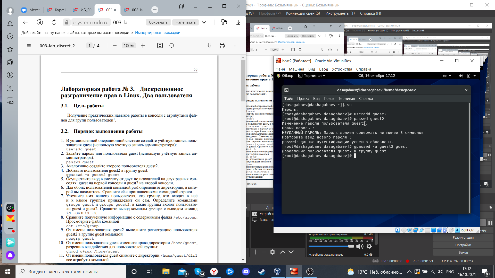
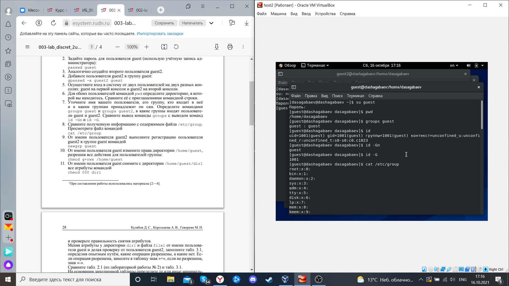
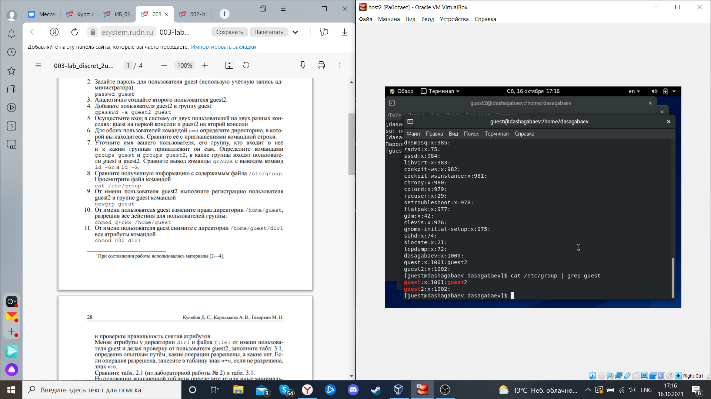
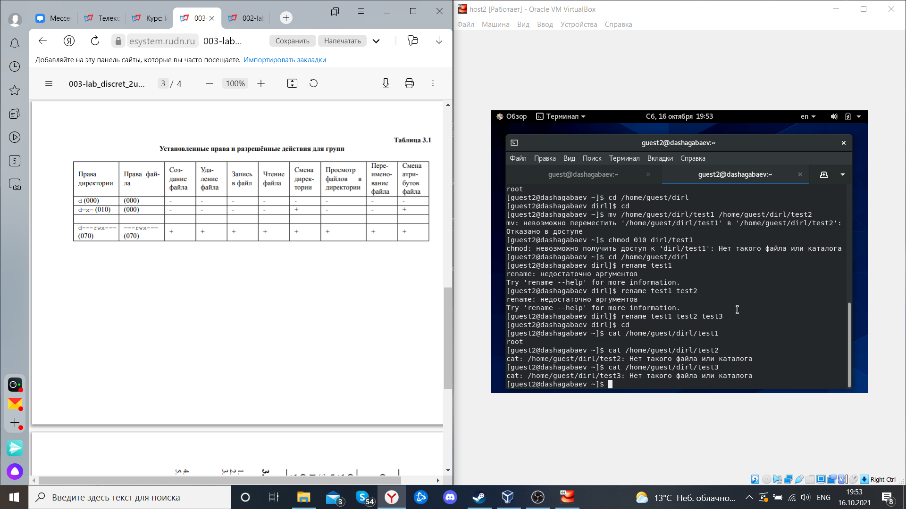
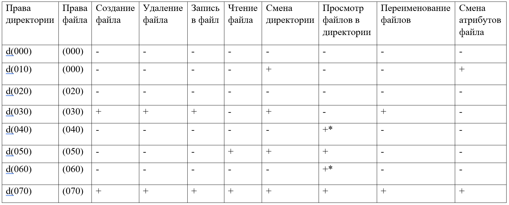
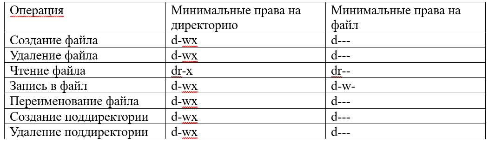

---
# Front matter
lang: ru-RU
title: "Лабораторная работа №3"
subtitle: "Дискреционное разграничение прав в Linux. Два пользователя"
author: "Шагабаев Давид, НПИбд-02-18"

# Formatting
toc-title: "Содержание"
toc: true # Table of contents
toc_depth: 2
lof: true # List of figures
lot: true # List of tables
fontsize: 12pt
linestretch: 1.5
papersize: a4paper
documentclass: scrreprt
polyglossia-lang: russian
polyglossia-otherlangs: english
mainfontoptions: Ligatures=TeX
romanfontoptions: Ligatures=TeX
sansfontoptions: Ligatures=TeX,Scale=MatchLowercase
monofontoptions: Scale=MatchLowercase
indent: true
pdf-engine: lualatex
header-includes:
  - \linepenalty=10 # the penalty added to the badness of each line within a paragraph (no associated penalty node) Increasing the value makes tex try to have fewer lines in the paragraph.
  - \interlinepenalty=0 # value of the penalty (node) added after each line of a paragraph.
  - \hyphenpenalty=50 # the penalty for line breaking at an automatically inserted hyphen
  - \exhyphenpenalty=50 # the penalty for line breaking at an explicit hyphen
  - \binoppenalty=700 # the penalty for breaking a line at a binary operator
  - \relpenalty=500 # the penalty for breaking a line at a relation
  - \clubpenalty=150 # extra penalty for breaking after first line of a paragraph
  - \widowpenalty=150 # extra penalty for breaking before last line of a paragraph
  - \displaywidowpenalty=50 # extra penalty for breaking before last line before a display math
  - \brokenpenalty=100 # extra penalty for page breaking after a hyphenated line
  - \predisplaypenalty=10000 # penalty for breaking before a display
  - \postdisplaypenalty=0 # penalty for breaking after a display
  - \floatingpenalty = 20000 # penalty for splitting an insertion (can only be split footnote in standard LaTeX)
  - \raggedbottom # or \flushbottom
  - \usepackage{float} # keep figures where there are in the text
  - \floatplacement{figure}{H} # keep figures where there are in the text
---

# Цель работы

Получение практических навыков работы в консоли с атрибутами файлов для групп пользователей.

# Выполнение лабораторной работы

1. В установленной операционной системе создайте учётную запись пользователя guest (использую учётную запись администратора): useradd guest  (рис. -@fig:026).

2. Задайте пароль для пользователя guest (использую учётную запись администратора): passwd guest

3. Аналогично создайте второго пользователя guest2.

4. Добавьте пользователя guest2 в группу guest:
    gpasswd -a guest2 guest

{ #fig:026 width=70% }

5. Осуществите вход в систему от двух пользователей на двух разных консолях: guest на первой консоли и guest2 на второй консоли.

6. Для обоих пользователей командой pwd определите директорию, в которой вы находитесь. Сравните её с приглашениями командной строки.

7. . Уточните имя вашего пользователя, его группу, кто входит в неё и к каким группам принадлежит он сам. Определите командами groups guest и groups guest2, в какие группы входят пользователи guest и guest2. Сравните вывод команды groups с выводом команд id -Gn и id -G.(рис. -@fig:027)(рис. -@fig:029)

8. Сравните полученную информацию с содержимым файла /etc/group. Просмотрите файл командой (рис. -@fig:028)(рис. -@fig:029)

   cat /etc/group

{ #fig:027 width=70% }

{ #fig:028 width=70% }

{ #fig:029 width=70% }
9. От имени пользователя guest2 выполните регистрацию пользователя guest2 в группе guest командой (рис. -@fig:029)

   newgrp guest

{ #fig:029 width=70% }

10. От имени пользователя guest измените права директории /home/guest, разрешив все действия для пользователей группы: 

    chmod g+rwx /home/guest

11. От имени пользователя guest снимите с директории /home/guest/dir1 все атрибуты командой (рис. -@fig:030)

    chmod 000 dirl

{ #fig:030 width=70% }

12. И проверьте правильность снятия атрибутов. Меняя атрибуты у директории dir1 и файла file1 от имени пользователя guest и делая проверку от пользователя guest2, заполните табл. 3.1, определив опытным путём, какие операции разрешены, а какие нет. Если операция разрешена, занесите в таблицу знак «+», если не разрешена, знак «-». Сравните табл. 2.1 (из лабораторной работы № 2) и табл. 3.1. На основании заполненной таблицы определите те или иные минимально необходимые права для выполнения пользователем guest2 операций внутри директории dir1 и заполните таблл. 3.2.(рис. -@fig:031)(рис. -@fig:032)

{ #fig:031 width=70% }

{ #fig:032 width=70% }

{ #fig:033 width=70% }
# Выводы

Получены практические навыки работы в консоли с атрибутами файлов для групп пользователей.