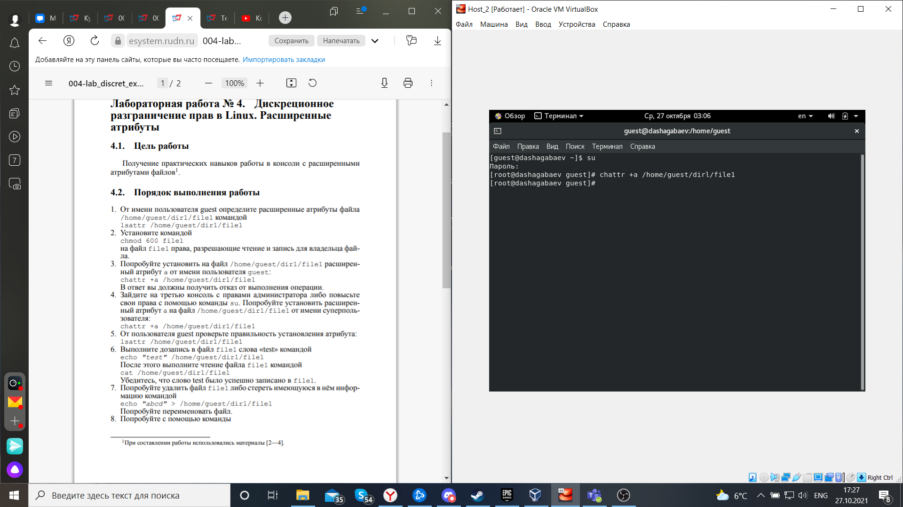
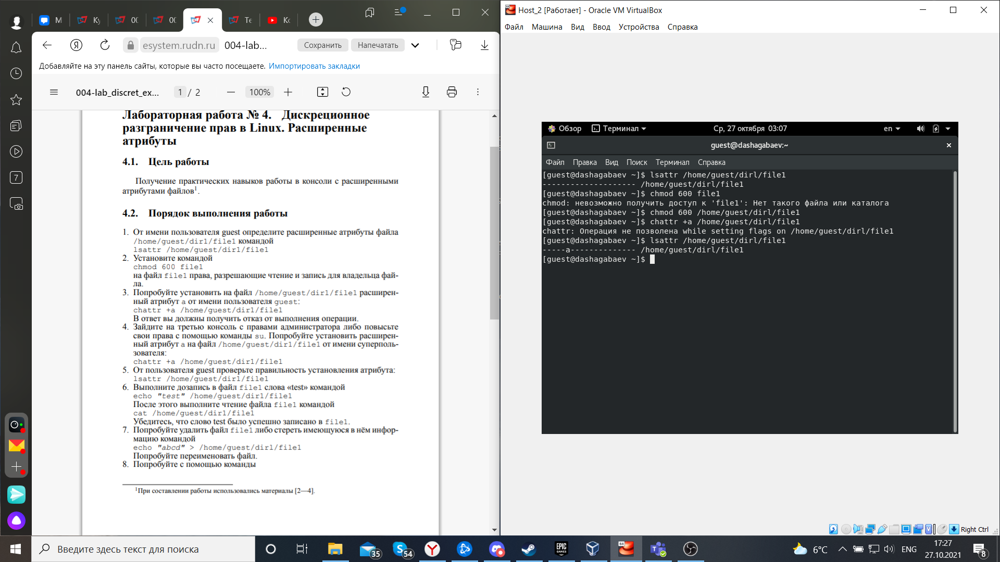
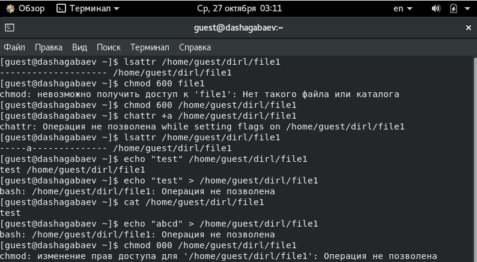
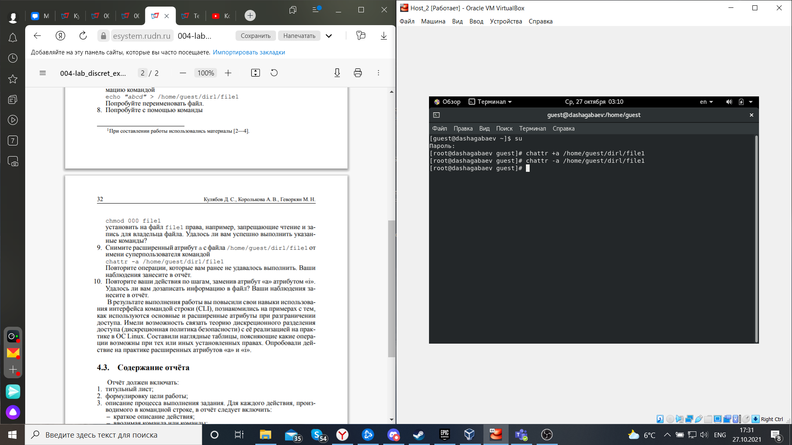
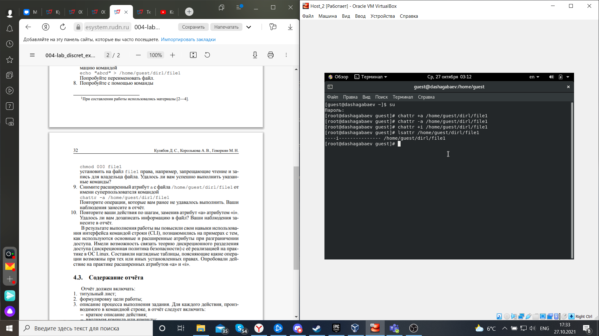
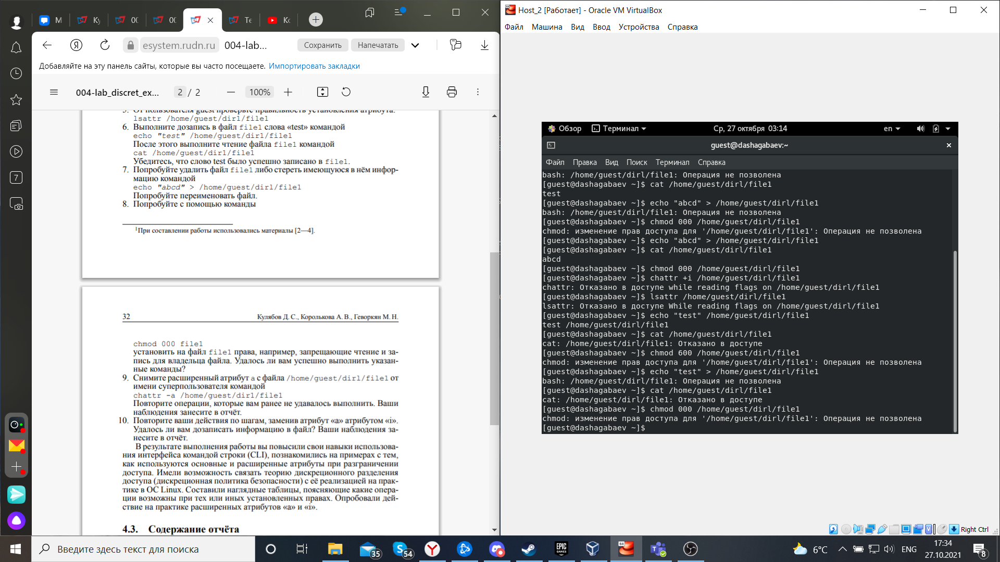

---
# Front matter
lang: ru-RU
title: "Лабораторная работа №4"
subtitle: "Дискреционное разграничение прав в Linux. Расширенные атрибуты"
author: "Шагабаев Давид, НПИбд-02-18"

# Formatting
toc-title: "Содержание"
toc: true # Table of contents
toc_depth: 2
lof: true # List of figures
lot: true # List of tables
fontsize: 12pt
linestretch: 1.5
papersize: a4paper
documentclass: scrreprt
polyglossia-lang: russian
polyglossia-otherlangs: english
mainfontoptions: Ligatures=TeX
romanfontoptions: Ligatures=TeX
sansfontoptions: Ligatures=TeX,Scale=MatchLowercase
monofontoptions: Scale=MatchLowercase
indent: true
pdf-engine: lualatex
header-includes:
  - \linepenalty=10 # the penalty added to the badness of each line within a paragraph (no associated penalty node) Increasing the value makes tex try to have fewer lines in the paragraph.
  - \interlinepenalty=0 # value of the penalty (node) added after each line of a paragraph.
  - \hyphenpenalty=50 # the penalty for line breaking at an automatically inserted hyphen
  - \exhyphenpenalty=50 # the penalty for line breaking at an explicit hyphen
  - \binoppenalty=700 # the penalty for breaking a line at a binary operator
  - \relpenalty=500 # the penalty for breaking a line at a relation
  - \clubpenalty=150 # extra penalty for breaking after first line of a paragraph
  - \widowpenalty=150 # extra penalty for breaking before last line of a paragraph
  - \displaywidowpenalty=50 # extra penalty for breaking before last line before a display math
  - \brokenpenalty=100 # extra penalty for page breaking after a hyphenated line
  - \predisplaypenalty=10000 # penalty for breaking before a display
  - \postdisplaypenalty=0 # penalty for breaking after a display
  - \floatingpenalty = 20000 # penalty for splitting an insertion (can only be split footnote in standard LaTeX)
  - \raggedbottom # or \flushbottom
  - \usepackage{float} # keep figures where there are in the text
  - \floatplacement{figure}{H} # keep figures where there are in the text
---

# Цель работы

Получение практических навыков работы в консоли с расширенными атрибутами файлов.

# Выполнение лабораторной работы

1. От имени пользователя guest определите расширенные атрибуты файла /home/guest/dir1/file1 командой 

    lsattr /home/guest/dir1/file1

2. Установите командой 

    chmod 600 file1  

    на файл file1 права, разрешающие чтение и запись для владельца файла.

3. Попробуйте установить на файл /home/guest/dir1/file1 расширенный атрибут a от имени пользователя guest: 

    chattr +a /home/guest/dir1/file1 

    В ответ вы должны получить отказ от выполнения операции.

{ #fig:037 width=70% }

4. Попробуйте установить расширенный атрибут a на файл /home/guest/dir1/file1 от имени суперпользователя: chattr +a /home/guest/dir1/file1

{ #fig:038 width=70% }

5. От пользователя guest проверьте правильность установления атрибута: 

   lsattr /home/guest/dir1/file1

{ #fig:039 width=70% }

6. Выполните дозапись в файл file1 слова «test» командой 

   echo "test" /home/guest/dir1/file1

   После этого выполните чтение файла file1 командой 

   cat /home/guest/dir1/file1 

   Убедитесь, что слово test было успешно записано в file1.

{ #fig:040 width=70% }

7. Попробуйте удалить файл file1 либо стереть имеющуюся в нём информацию командой 

   echo "abcd" > /home/guest/dirl/file1 

   Попробуйте переименовать файл.

8. Попробуйте с помощью команды

   chmod 000 file1 

   установить на файл file1 права, например, запрещающие чтение и запись для владельца файла. 

{ #fig:040.1 width=70% }

9. Снимите расширенный атрибут a с файла /home/guest/dirl/file1 от имени суперпользователя командой 

   chattr -a /home/guest/dir1/file1 

   Повторите операции, которые вам ранее не удавалось выполнить.

{ #fig:041 width=70% }

{ #fig:042 width=70% }

10. Повторите ваши действия по шагам, заменив атрибут «a» атрибутом «i». Удалось ли вам дозаписать информацию в файл? Ваши наблюдения занесите в отчёт.

{ #fig:043 width=70% }

{ #fig:044 width=70% }

{ #fig:045 width=70% }

# Выводы

В результате выполнения работы вы повысили свои навыки использования интерфейса командой строки (CLI), познакомились на примерах с тем, как используются основные и расширенные атрибуты при разграничении доступа. Имели возможность связать теорию дискреционного разделения доступа (дискреционная политика безопасности) с её реализацией на практике в ОС Linux. Составили наглядные таблицы, поясняющие какие операции возможны при тех или иных установленных правах. Опробовали действие на практике расширенных атрибутов «а» и «i».