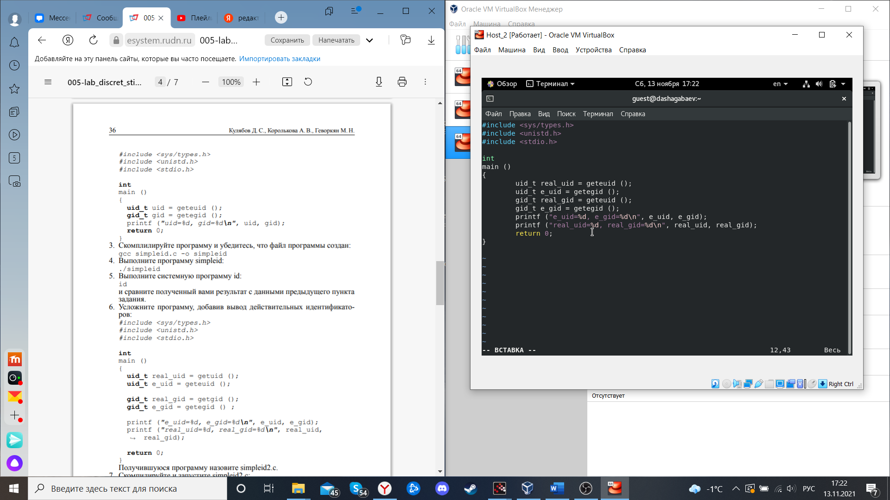

---
# Front matter
lang: ru-RU
title: "Лабораторная работа №5"
subtitle: "Дискреционное разграничение прав в Linux. Исследование влияния дополнительных атрибутов"
author: "Шагабаев Давид, НПИбд-02-18"

# Formatting
toc-title: "Содержание"
toc: true # Table of contents
toc_depth: 2
lof: true # List of figures
lot: true # List of tables
fontsize: 12pt
linestretch: 1.5
papersize: a4paper
documentclass: scrreprt
polyglossia-lang: russian
polyglossia-otherlangs: english
mainfontoptions: Ligatures=TeX
romanfontoptions: Ligatures=TeX
sansfontoptions: Ligatures=TeX,Scale=MatchLowercase
monofontoptions: Scale=MatchLowercase
indent: true
pdf-engine: lualatex
header-includes:
  - \linepenalty=10 # the penalty added to the badness of each line within a paragraph (no associated penalty node) Increasing the value makes tex try to have fewer lines in the paragraph.
  - \interlinepenalty=0 # value of the penalty (node) added after each line of a paragraph.
  - \hyphenpenalty=50 # the penalty for line breaking at an automatically inserted hyphen
  - \exhyphenpenalty=50 # the penalty for line breaking at an explicit hyphen
  - \binoppenalty=700 # the penalty for breaking a line at a binary operator
  - \relpenalty=500 # the penalty for breaking a line at a relation
  - \clubpenalty=150 # extra penalty for breaking after first line of a paragraph
  - \widowpenalty=150 # extra penalty for breaking before last line of a paragraph
  - \displaywidowpenalty=50 # extra penalty for breaking before last line before a display math
  - \brokenpenalty=100 # extra penalty for page breaking after a hyphenated line
  - \predisplaypenalty=10000 # penalty for breaking before a display
  - \postdisplaypenalty=0 # penalty for breaking after a display
  - \floatingpenalty = 20000 # penalty for splitting an insertion (can only be split footnote in standard LaTeX)
  - \raggedbottom # or \flushbottom
  - \usepackage{float} # keep figures where there are in the text
  - \floatplacement{figure}{H} # keep figures where there are in the text
---

# Цель работы

Изучение механизмов изменения идентификаторов, применения SetUID- и Sticky-битов. Получение практических навыков работы в консоли с дополнительными атрибутами. Рассмотрение работы механизма смены идентификатора процессов пользователей, а также влияние бита Sticky на запись и удаление файлов.

# Выполнение лабораторной работы

1. Установка gcc командой

    yum install gcc

    { #fig:001 width=70% }

2. Создайте программу simpleid.c от пользователя guest.

    { #fig:002 width=70% }

3. . Скомплилируйте программу и убедитесь, что файл программы создан: 

    gcc simpleid.c -o simpleid

4. Выполните программу simpleid: 

   ./simpleid

5. Выполните системную программу id: 

   id

   { #fig:003 width=70% }

6. Усложните программу, добавив вывод действительных идентификаторов:

   Получившуюся программу назовите simpleid2.c

   { #fig:004 width=70% }

7. Скомпилируйте и запустите simpleid2.c: 

   gcc simpleid2.c -o simpleid2 

   ./simpleid2

   { #fig:005 width=70% }

8. От имени суперпользователя выполните команды:

   chown root:guest /home/guest/simpleid2 
   chmod u+s /home/guest/simpleid2
   
   { #fig:006 width=70% }

9. Выполните проверку правильности установки новых атрибутов и смены владельца файла simpleid2: 

   ls -l simpleid2

10. Запустите simpleid2 и id:

    ./simpleid2

    id

11. Проделайте тоже самое относительно SetGID-бита.

    { #fig:007 width=70% }

12. Создайте программу readfile.c:

    { #fig:008 width=70% }

13. Откомпилируйте её. 

    gcc readfile.c -o readfile

14. Смените владельца у файла readfile.c (или любого другого текстового файла в системе) и измените права так, чтобы только суперпользователь (root) мог прочитать его, a guest не мог.

15. Проверьте, что пользователь guest не может прочитать файл readfile.c.

16. Смените у программы readfile владельца и установите SetU’D-бит.

17. Проверьте, может ли программа readfile прочитать файл readfile.c?

18. Проверьте, может ли программа readfile прочитать файл /etc/shadow?

    { #fig:009 width=70% }

    { #fig:011 width=70% }

19. Выясните, установлен ли атрибут Sticky на директории /tmp, для чего выполните команду 

    ls -l / | grep tmp

20. От имени пользователя guest создайте файл file01.txt в директории /tmp со словом test: echo "test" > /tmp/file01.txt

21. Просмотрите атрибуты у только что созданного файла и разрешите чтение и запись для категории пользователей «все остальные»: 

    ls -l /tmp/file01.txt 

    chmod o+rw /tmp/file01.txt 

    ls -l /tmp/file01.txt

22. От пользователя guest2 (не являющегося владельцем) попробуйте прочитать файл /tmp/file01.txt: 

    cat /tmp/file01.txt

23. От пользователя guest2 попробуйте дозаписать в файл /tmp/file01.txt слово test2 командой 

    echo "test2" > /tmp/file01.txt

24. Проверьте содержимое файла командой cat /tmp/file01.txt

25. От пользователя guest2 попробуйте записать в файл /tmp/file01.txt слово test3, стерев при этом всю имеющуюся в файле информацию командой 

    echo "test3" > /tmp/file01.txt

26. Проверьте содержимое файла командой 

    cat /tmp/file01.txt

27. От пользователя guest2 попробуйте удалить файл /tmp/file01.txt командой 

    rm /tmp/fileOl.txt

28. Повысьте свои права до суперпользователя следующей командой 

    su -

    { #fig:012 width=70% }

29. и выполните после этого команду, снимающую атрибут t (Sticky-бит) с директории /tmp: chmod -t /tmp

30. Покиньте режим суперпользователя командой 

    exit

31. От пользователя guest2 проверьте, что атрибута t у директории /tmp нет: 

    ls -l / | grep tmp

32. Повторите предыдущие шаги. Какие наблюдаются изменения?

    { #fig:013 width=70% }

# Выводы

Изучили механизмы изменения идентификаторов, применения SetUID- и Sticky-битов. Получили практические навык работы в консоли с дополнительными атрибутами. Рассмотрение работы механизма смены идентификатора процессов пользователей, а также влияние бита Sticky на запись и удаление файлов.